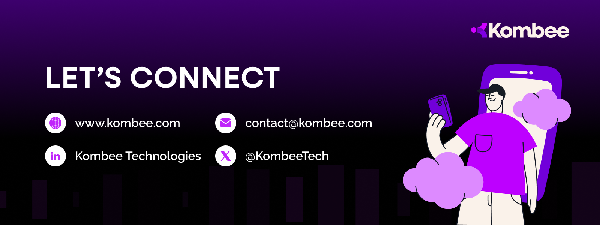

# Welcome to **Kombee Technologies** 🚀

---

## 🌟 **About Us**

At **Kombee Technologies**, we redefine innovation in the IT world by delivering tailored, secure, and scalable solutions that empower businesses to thrive. Whether you need intuitive **mobile applications**, powerful **enterprise software**, or robust **IT infrastructure**, we’re here to turn your vision into reality.

---

## 🚀 **Technologies We Master**

### **[Mobile Development](https://github.com/MobileApp-Dev-Kombee)** 🚀

### **[Web Development](https://github.com/Web-Dev-Kombee)** 🌐

### **DevOps & Cloud** ☁️

### **Design Expertise** 🎨

---

## 💼 **Our Services**

Explore our wide array of IT services designed to cater to every business need:

### **1. Mobile App Development** 📱

Delivering seamless, feature-rich applications for:

- **Cross-platform Frameworks**: Flutter, React Native, Ionic, Xamarin, FlutterFlow.
- **Native Development**: iOS (Swift, Objective-C), Android (Kotlin, Java).
- **Progressive Web Apps (PWAs)**.
- **Wearable and Embedded Systems Apps**.

Explore our expertise in mobile app development with cutting-edge frameworks and discover our open-source tools on our [GitHub](https://github.com/MobileApp-Dev-Kombee).

### **2. Web Development** 🌐

Crafting responsive and modern web experiences using:

- **Frontend Frameworks**: React.js, Angular, Vue.js, Svelte.
- **Backend Frameworks**: Laravel, Node.js, Django, Flask, ASP.NET, Ruby on Rails, Spring Boot.
- **Full-stack Solutions**: MERN, MEAN, LAMP, JAMstack.

### **3. Backend Solutions** 🔗

Designing secure and high-performance systems:

- API Development.
- Real-time Data Processing.
- Microservices Architecture.
- Event-driven Architecture.
- Backend Services with GraphQL, REST APIs, and gRPC.

### **4. IT Infrastructure & Networking** 🖧

Strengthen your digital backbone with:

- Server and Network Setup.
- Cloud Deployment.
- Cybersecurity and Optimization.
- Containerization and Orchestration (Docker, Kubernetes).

### **5. Cloud Solutions** ☁️

Future-proof your business with our cloud expertise:

- **Platforms**: AWS, Azure, Google Cloud, DigitalOcean, IBM Cloud.
- Migration & Scalability.
- Serverless Architecture.

### **6. UI/UX Design** 🎨

Creating visually stunning and user-friendly designs:

- **Prototypes**: Interactive mockups for every screen.
- **Design Systems**: Cohesive branding and usability.

### **7. Database Management** 🗄️

Handling your data with precision and security:

- Relational Databases: MySQL, PostgreSQL, MariaDB, SQL Server, Oracle.
- NoSQL Databases: MongoDB, CouchDB, Cassandra, DynamoDB.
- In-memory Databases: Redis, Memcached.
- Data Warehousing: Snowflake, BigQuery, Redshift.

### **8. DevOps & Automation** ⚙️

Streamlining workflows and deployments:

- CI/CD Pipelines: Jenkins, GitHub Actions, GitLab CI.
- Infrastructure as Code: Terraform, Ansible, Chef, Puppet.
- Monitoring and Logging: Prometheus, Grafana, ELK Stack, Datadog.
- Version Control: Git, GitHub, GitLab, Bitbucket.
- Code Quality: SonarQube, ESLint, Prettier.

### **9. AI, ML, and Data Science** 🤖
Markdown
Unlock the potential of data with AI/ML expertise:

- Machine Learning Frameworks: TensorFlow, PyTorch, Scikit-learn.
- AI Solutions: Natural Language Processing, Computer Vision, Recommendation Systems.
- Data Engineering: Apache Hadoop, Apache Spark, Kafka.
- Deep Learning: Neural Networks, CNN, RNN, LSTM.

### **10. IoT and Embedded Systems** 🌐

Connecting devices and enabling smarter systems:

- IoT Platforms: AWS IoT, Azure IoT Hub, Google Cloud IoT.
- Embedded Programming: Arduino, Raspberry Pi, ESP32.
- Sensor Integration & Data Collection.
- Real-time Monitoring Systems.

---

## 🎯 **Our Mission**

To empower businesses with innovative, secure, and sustainable IT solutions, fostering growth in a rapidly evolving technological world.

---

## 🛠️ **Showcase Projects**

### **Mobile Apps**

 [Mobile Apps](https://github.com/MobileApp-Dev-Kombee) 🛒
<!-- - [Flutter E-Commerce Platform](https://github.com/YourOrg/FlutterECommerceApp) 🛒
- [React Native Food Delivery App](https://github.com/YourOrg/ReactNativeFoodApp) 🍔 -->
<!--
### **Web Applications**

- [React.js Portfolio Website](https://github.com/YourOrg/ReactPortfolio) 🌐
- [Angular Admin Dashboard](https://github.com/YourOrg/AngularDashboard) 🛠️

### **Backend Systems**

- [Node.js API Gateway](https://github.com/YourOrg/NodeAPIService) 🔗
- [Django CRM System](https://github.com/YourOrg/DjangoCRM) 💼 -->

---

## 🌐 **Let’s Connect**

We’re excited to collaborate and bring your ideas to life!

<!-- ---

## 👥 **Meet the Team**

Our diverse and talented team combines expertise, creativity, and passion to deliver exceptional solutions for your business challenges.

 -->

---

## ⭐ **Star Us**

If you love what we’re building, support us by giving a ⭐ on our projects and following our journey!

